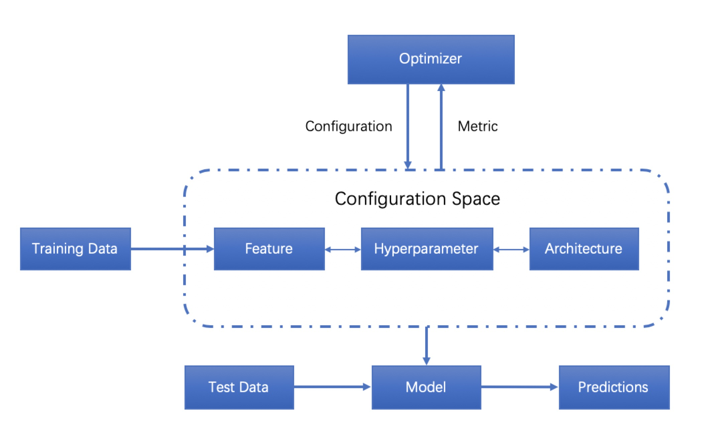
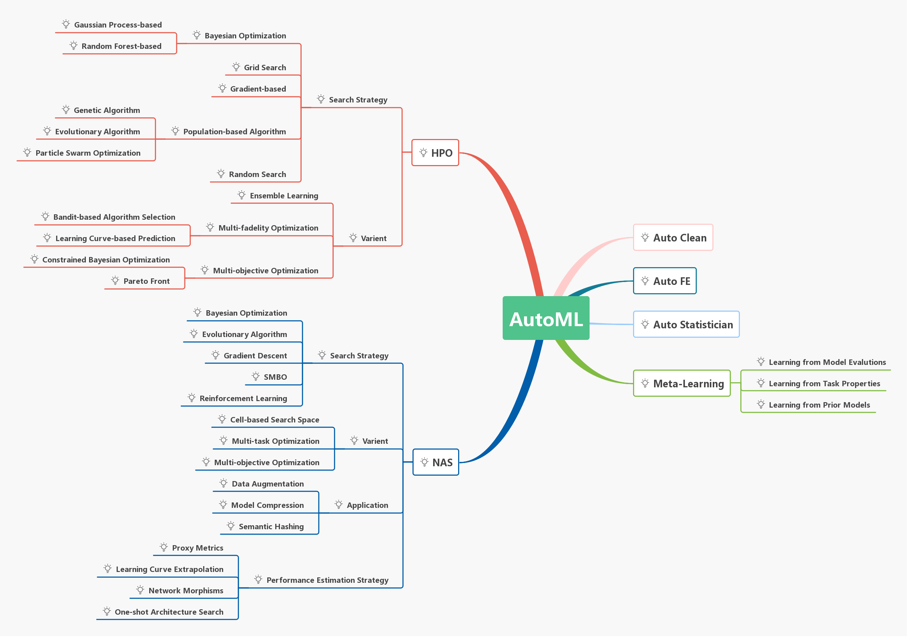

# AutoML (Automation of Machine Leanring)

AutoML은 말 그대로 머신러닝을 위한 다음과 같은 사항들을 모두 자동화하여 머신러닝을 모르는 사람들도 자율적으로 어려움없이 학습을 할 수 있도록 하는 목표를 가진 연구분야라고 할 수 있다.

* Preprocess the data,
* Select appropriate features,
* Select an appropriate model family,
* Optimize model hyperparameters,
* Postprocess machine learning models,
* Critically analyze the results obtained.

위과 같은 과정들을 포함하여 일반적읜 AutoML은 다음과 같이 나타낼 수 있다.

이러한 AutoML은 다음과 같은 주제들을 중심으로 연구가 진행되고 있다. 

* Automated Data Clean (Auto Clean)
* Automated Feature Engineering (Auto FE)
* Hyperparameter Optimization (HPO)
* Meta-Learning
* Neural Architecture Search (NAS)

위에서도 알 수 있듯이, NAS와 HPO가 가장 활발히 연구가 진행되고 있다. 

### papers

#### Surveys
| Conference | Title | paper | code |
|---|:---:|:---:|---:|
| 2018 | Taking the Human out of Learning Applications: A Survey on Automated Machine Learning |[paper](https://arxiv.org/pdf/1810.13306.pdf) | [code]() |
| 2019 | AutoML: A Survey of the State-of-the-Art | [paper](https://arxiv.org/pdf/1908.00709.pdf) | [code]() |
| 2019 | Benchmark and Survey of Automated Machine Learning Frameworks | [paper](https://arxiv.org/pdf/1904.12054.pdf) | [code]() |
| 2019 | Automated Machine Learning: State-of-The-Art and Open Challenges |[paper](https://arxiv.org/pdf/1906.02287.pdf) | [code]() |
| 2020 | On Hyperparameter Optimization of Machine Learning Algorithms: Theory and Practice |[paper](https://arxiv.org/pdf/2007.15745.pdf) | [code]() |

#### NAS

* Reinforcement Learning
| Conference | Title | paper | code |
|---|:---:|:---:|---:|
| ICLR 2017 | Nerual Architecture Search with Reinforcement Elarning | [paper](https://arxiv.org/pdf/1611.01578.pdf) | [code]() |
| 2018 | Efficient Neural Architecture Search via Parameter Sharing | [paper](https://arxiv.org/pdf/1802.03268.pdf) | [code]() |
| ECCV 2018 | AMC: AutoML for Model Compression and Acceleration on Mobile Devices |[paper](https://openaccess.thecvf.com/content_ECCV_2018/papers/Yihui_He_AMC_Automated_Model_ECCV_2018_paper.pdf) | [code]() |

#### Hyper-Parameter Optimization
* Bayeisan Optimization

### References
1. https://github.com/hibayesian/awesome-automl-papers#surveys
