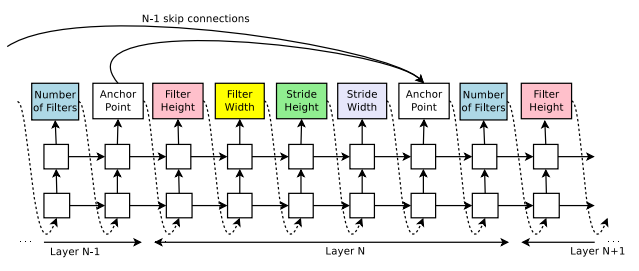

# Neural Architecture Search with Reinforcement Learning

AutoML에서 딥러닝 모델을 최적화하는 NAS(Neural Architecture Search) 분야를 나타내는 대표적인 논문으로 분야의 이름과 동일하게 NAS라고도 알려져 있습니다. 그리고 본 논문은 제목에서 알 수 있듯이 강화학습을 이용하여 Deep Neural Network의 구조를 탐색하는 방법을 이야기하며, 이는 다음의 NASNet이나 다른 NAS의 연구들에 아이디어를 제공하는 발딘이 되기도 합니다. 

본 논문은 두 가지 종류의 네트워크를 자동으로 생성하는 방법을 제안한다. 
1. Image classification을 위한 CNNs
2. recurrent cell

NAS의 기본적인 아이디어는 RNN으로 구성된 controller를 이용하여child network를 만들고, 특정 데이터셋에 대하여 validation accuracy가 
수렴할 때까지 child network를 학습시킵니다. 그리고 수렴한 validation accuracy를 reward로 설정하여 이를 최대화하는 방향으로 policy 
gradient를 이용하여 controller를 학습합니다. 

Controller는 하나의 convolutional layer에 대한 hyperparamenter(필터의 개수와 크기, stride, ...)을 결정합니다. 
구체적으로는 다음의 리스트에서 각각의 hyperparameter를 선택합니다. 

* filter height in [1, 3, 5, 7]
* filter width in [1, 3, 5, 7]
* number of filters in [24, 36, 48, 64]
* strides in [1, 2, 3] (or 1)

이러한 controller는 다음과 같이 RNN으로 구성되어 각각의 cell은 위의 hyperparameter 중 하나를 담당하고 있습니다. 

그리고 ResNet과 같이 skip connection을 도입하기 위해서 anchor point를 적용한 것을 볼 수 있고, 이는 $i$번째 layer가 
$0 ~ (i - 1)$번째 layer와 연결될 확률을 의미합니다. 단, 이러한 방식은 특정 확률에 따라 일부 layer는 input이나 output layer가 전혀 
없을 수도 있기 때문에 input이 없는 layer는 초기 입력 이미지를 input으로 하고, output이 없는 layer는 기존의 최상단 layer에 depth방향으로 
concatenation을 zero padding을 적용합니다. 

